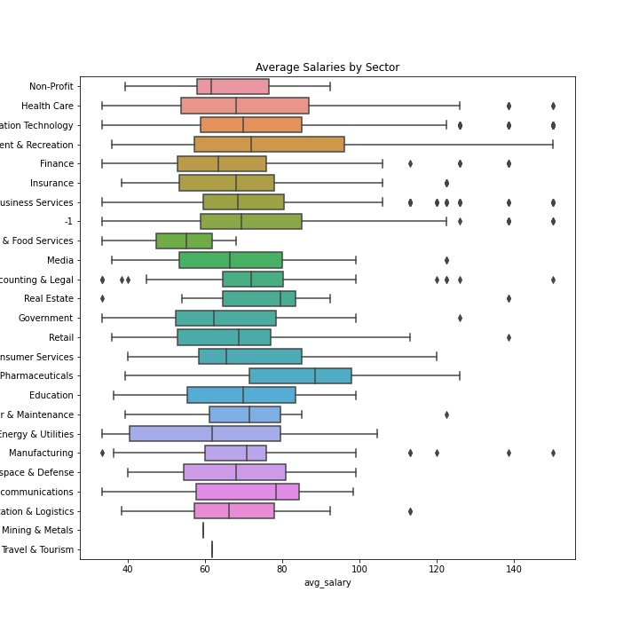
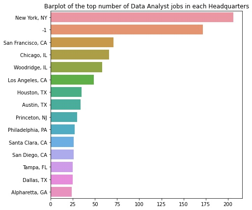

# Data Analyst Salary Predictor Project

 ### Project Overview:
 
This project consisted of analyzing the skills needed for data analyst positions as well as predict the salaries for such positions (MAE approx 14.83K). I also analyzed the locations that had the most jobs available, their available salaries, which type of specific data analyst jobs were available, as well as which specific job titles had the highest ratings. I used data that was scraped from glassdoor.com and can be found at the following link: https://www.kaggle.com/andrewmvd/data-analyst-jobs. 

As data analyst positions become more popular as the field grows, I hope the results of this project help those who are looking for such positions. Those on the job market could use the results of this project to zone in on what skills they should acquire, where they could potentitally look for jobs, as well as analyzee which sectors value the position the most.  

Part of the project consisted of generating features from the text of the job description to find the which skills were required for such position. Examples include, SQL, Excel, Tableau, Power-BI, and Python. 

Extensive exploratory data analysis was used for the findings and can be referenced below. A few important items that stand out from the data are as follows: 
- SQL is an absolutely necessary skill that all data analyst should know. 
- Tableau also seems to be the data visualization dashboard program of choice. 
- Biotech & Pharmaceuticals, Real Estate, and Arts were among the highest paying sectors for data analyst. 
- Drug and Health stores, Education Training Services, and Health Care Products Manufactoring were among the highest paying industries. 
- California, Colorado, Illinois were among the highest paying states for data analyst positions. 
- Positions which included the title of 'Data Security Analyst' had the highest salaries. 

Modelling the salaries consisted of the regularization methods Lasso, Ridge, Elastic Net as well as the powerful XGBoost model. I used GridSearchCV on the regularization models and the built in hyperparameter tuning feature of XGBoost to optimize the models. 

## Code and Resources Used 
**Python Version:** 3.9  
**Packages:** pandas, numpy, sklearn, matplotlib, seaborn, xgboost

_Inspiration for this project comes from Ken Jee's video on data scientist salaries. Here is the link to his YouTube Video: https://www.youtube.com/watch?v=MpF9HENQjDo. While my project is similar, this work uses a different data set on a different position and a substantially different algorithmic, EDA, and model framework._

## Data Cleaning
There was only a small amount of data cleaning necessary for this project. In particular, for part 1, there was missing data in the reject_code column of the dim_claims_df data frame. I chose to replace the missing data with 0 using the fillna method from pandas. I chose to use zero because no reject_code meant that your pharmacy claim got approved. 

## EDA

* Box plot detailing which sector paid a higher average salary. A detailed pivot table was also given in the salary_eda.ipynb file for more explicit numbers.  

* The following graph shows the average salaries of data analyst jobs whose job descriptions indicated a PhD as a preference. Not many jobs indicating this but when they do the salaries can be significantly higher. 

* Bar chart indicating the number of available jobs in reference to the company's headquarters. As we can see, New York lead the way in terms of the number of such jobs being offered.  

* The following is a box plot indicating the average salaries for data analyst positions whose job descriptions indicate SQL as a desired skill. It is clear that not only do positions want SQL, but it also pays a higher salary to know the language. 

## Model Building 

**Part 1**: 
First, I transformed the categorical variables into dummy variables using a one hot encoder. I also split the data into train and tests sets with a test size of 30%.   

I used a random forest classifier for the moodel and evaluated the model using the accuracy, precision, recall, and AUC metrics. I chose a random forest classifier because of the sparsity associated with the data as well as the primary binary nature of each feature. 

A GridSearchCV was performed on the random forest model where I analyzed the max_depth hyperparameter. The GridSearchCV returned that the random forest classifier with a max_depth hyperparameter equal to 5 performed more optimally on the precision metric. I consequentely used this model for the prediction. 

## Models Used: 
*	**Lasso Regression** – A baseline for the model. Given the sparsity of the data after one hot encoding, we could use feature selection to help with the predictions. 
*	**Ridge Regression** – Given the present (slight) multicollinearity of the features, ridge regression could provide as a nice alternative to Lasso. 
*	**Elastic Net Regression** –  See if we could potentially balance the l1 and l2 regularization techniques. 
*	**XGBoost** – With the sparsity and binary nature of the data, a tree based boosted model seemed to have a solid chance to lower the MAE as much as possible. 

I ultimately opted with the XGBoost due to MAE performance as well as wanting to avoid overtraining. Hyperparameter tuning using the XGBoost built in feature also allowed me to get the best MAE on the validation data from all models. 

## Model performance

**Part 1**: 
Using cross validation, we got the following explicit scores. Since hyperparameter tuning was used (using GridSearchCV and XGBoost built in tuning) for all of our models, we also give the found parameters. 

Lasso Regression Score: 
*	MAE: 15.23
- Hyperparameters: alpha=0.01

Ridge Regression Score: 
*	MAE: 15.40
- Hyperparameters: 0.11 

Elastic Net Regression Score: 
*	MAE: 17.67
- Hyperparameters: alpha=0.01 and l1_ratio=0.01

XGBoost Score: 
*	MAE: 14.83 (in 30 boosting rounds)
- Hyperparameters: max_depth=7, min_child_weight=7, eta= 0.1, subsample=1
