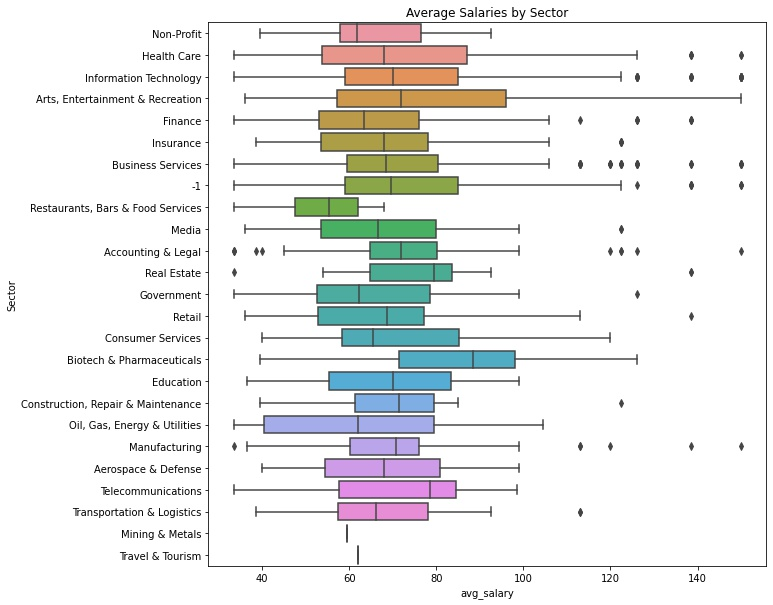
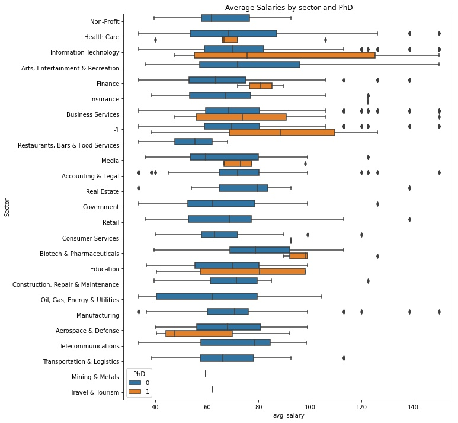

# Data Analyst Salary Predictor Project

  
  

  
  

 ### Project Overview:
 
This project consisted of analyzing the skills needed for data analyst positions as well as predict the salaries for such positions (MAE approx 14.83K). I also analyzed the locations that had the most jobs available, their available salaries, which type of specific data analyst jobs were available, as well as which specific job titles had the highest ratings. I used data that was scraped from glassdoor.com and can be found at the following link: https://www.kaggle.com/andrewmvd/data-analyst-jobs. 

As data analyst positions become more popular as the field grows, I hope the results of this project help those who are looking for such positions. Those on the job market could use the results of this project to zone in on what skills they should acquire, where they could potentitally look for jobs, as well as analyze which sectors value the position the most.  

Part of the project consisted of generating features from the text of the job description to find the which skills were required. Examples include, SQL, Excel, Tableau, Power-BI, and Python. 

Extensive exploratory data analysis was used for the findings and can be referenced below. A few important items that stand out from the data are as follows:
- Average salary for all positions is about 72.12K and average rating for all companies is about 3.16
- 28% of companies wanted Python skills and about 60% wanted sql or excel. 
- 100% of positions wanted at least a bachelor's degree, 36% wanted a master's, 2% only wanted a PhD. 
- Companies whose revenues were between 1 and 5 million paid the highest average salary at about 76 thousand. In contrast, the companies with revenues of 500 million to 1 billion were near the bottom. 
- SQL is an absolutely necessary skill that all data analyst should know. 
- Tableau also seems to be the data visualization dashboard program of choice. In particular, 27% of positions wanted Tableau over the 7% that wanted Power BI
- Biotech & Pharmaceuticals, Real Estate, and Arts were among the highest paying sectors for data analyst. 
- Drug and Health stores, Education Training Services, and Health Care Products Manufactoring were among the highest paying industries. 
- California, Colorado, Illinois were among the highest paying states for data analyst positions. 
- Data Security Analyst had the highest salaries (~81K) but one of the lower average rating at around 2.79. 

Modelling the salaries consisted of the regularization methods Lasso, Ridge, Elastic Net as well as the powerful XGBoost. I used GridSearchCV on the regularization models and the built in hyperparameter tuning feature of XGBoost to optimize that model. 

## Code and Resources Used 
**Python Version:** 3.9  
**Packages:** pandas, numpy, sklearn, matplotlib, seaborn, xgboost

**Books Used**: 
- Grus, Joel. Data science from scratch: first principles with python. O'Reilly Media, 2019.
- Bruce, Peter, Andrew Bruce, and Peter Gedeck. Practical Statistics for Data Scientists: 50+ Essential Concepts Using R and Python. O'Reilly Media, 2020.
- McKinney, Wes. Python for data analysis: Data wrangling with Pandas, NumPy, and IPython. " O'Reilly Media, Inc.", 2012.

**URLs Used**: 
- https://blog.cambridgespark.com/hyperparameter-tuning-in-xgboost-4ff9100a3b2f
- https://towardsdatascience.com/feature-selection-and-eda-in-python-c6c4eb1058a3
- _Inspiration for this project comes from Ken Jee's video on data scientist salaries. Here is the link to his YouTube Video: https://www.youtube.com/watch?v=MpF9HENQjDo. While my project is similar, this work uses a different data set on a different position and a substantially different algorithmic, EDA, and model framework._

## Data Cleaning: 
There was a significant amount of cleaning that needed to be done for this project. We first needed to extract the target feature avg_salary. This was done using multiple split and lambda functions. I engineered features by extracting specific job position titles (e.g. data analyst, business analyst, data management, data scientist, data warehouse engineer, data engineer, data security analyst, and risk analyst) as well as specific seniority (e.g. junior, senior, and N/A). More feature engineering was needed by extracting traits of each company like age, company size, and the location (state only). An important feature extraction consisted of acquiring the skills needed for data analyst positions. I did this by considering the job description of the position and extracting some potential traits. Some traits that were extracted were SQL, Tableau, Python, Power BI, Excel, Deep Learning, PhD, and Masters degree. Many of these features were imperative not only for the EDA portion of the project but also for the modeling portion.  

## EDA
The following images are highlights of the exploratory data analysis performed on this data set. There is much more detailed analysis given in the salary_eda.ipynb notebook. 

* Box plot detailing which sector paid a higher average salary. A detailed pivot table was also given in the salary_eda.ipynb file for more explicit numbers.  

* The following graph shows the average salaries of data analyst jobs whose job descriptions indicated a PhD as a preference. Not many jobs indicated this but when they do the salaries can be significantly higher. 

* Bar chart indicating the number of available jobs in reference to the company's headquarters. As we can see, New York lead the way in terms of the number of such jobs being offered.  

* This box plot shows the average salaries for data analyst positions whose job descriptions indicate SQL as a desired skill. It is clear that not only do companies desire SQL as a necessary skill, but it also pays a higher salary to know the language. 

## Model Building: 
Selected features from the feature selection notebook for the Lasso model and evaluated more features for the remaining models. I chose the features based off of the EDA done in the corresponding notebook. For the regularization models, I scaled the data with the built in normaize method for each model. After all features were selected I transformed the categorical variables into dummy variables using the pd.get_summies method. I split the data into train and tests sets with a test size of 30%. For the XGBoost model I first put the data set in the necessary form using Dmatrix and constructed a baseline model using default parameters before tuning. 

## Models Used: 
*	**Lasso Regression** – A baseline for the model. Given the sparsity of the data after one hot encoding, we could use feature selection to help with the predictions. 
*	**Ridge Regression** – Given the present (slight) multicollinearity of the features, ridge regression could provide as a nice alternative to Lasso. 
*	**Elastic Net Regression** –  See if we could potentially balance the l1 and l2 regularization techniques. 
*	**XGBoost** – With the sparsity and binary nature of the data, a tree based boosted model seemed to have a solid chance to lower the MAE as much as possible. 

I ultimately opted with the XGBoost due to MAE performance as well as wanting to avoid overtraining. Hyperparameter tuning using the XGBoost built in feature also allowed me to get the best MAE on the validation data from all models. 

## Model performance

**Part 1**: 
Using cross validation, we got the following explicit MAE scores. Since hyperparameter tuning was used (using GridSearchCV and XGBoost built in tuning) for all of our models, we also give the found parameters. 

Lasso Regression Score: 
*	MAE: 15.23
- Hyperparameters: alpha=0.01

Ridge Regression Score: 
*	MAE: 15.40
- Hyperparameters: alpha=0.11 

Elastic Net Regression Score: 
*	MAE: 17.67
- Hyperparameters: alpha=0.01 and l1_ratio=0.01

XGBoost Score: 
*	MAE: 14.83 (in 30 boosting rounds)
- Hyperparameters: max_depth=7, min_child_weight=7, eta= 0.1, subsample=1
